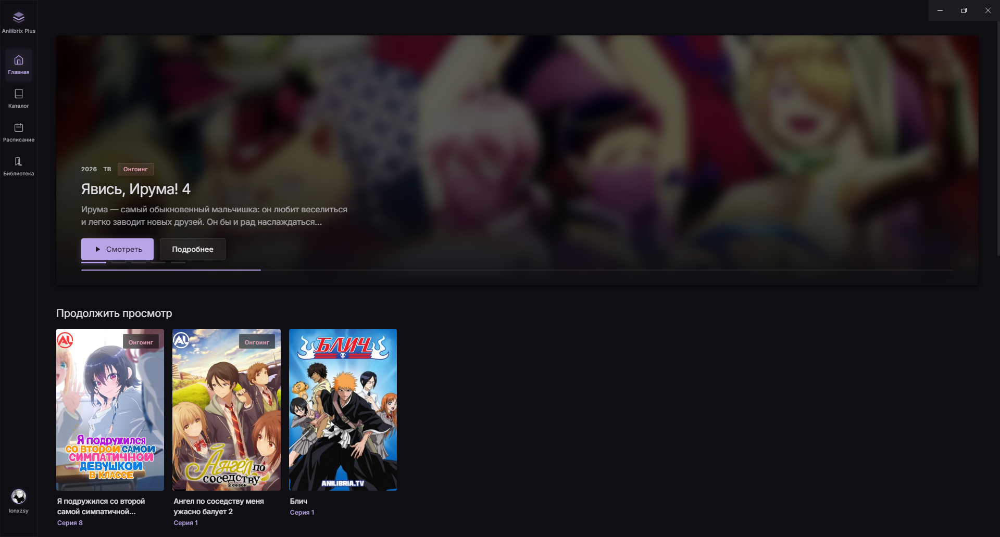
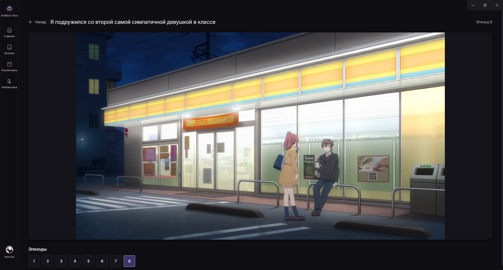

# Anilibrix Plus

> Desktop клиент для просмотра аниме на базе [Anilibria TV](https://anilibria.tv). Создан с любовью на Electron + Vue 3 + Material Design 3.

<p align="center">
  
  
  
  
</p>

---

## Возможности

- **Каталог** — просмотр всех доступных релизов Anilibria с поиском и фильтрами.
- **Расписание** — актуальное расписание выхода новых серий.
- **Плеер** — кастомный плеер на базе HTML5 Video + HLS.js:
  - Пропуск опенинга / эндинга
  - Автопереключение на следующую серию
  - Субтитры (SRT / VTT) с настройкой стиля
  - Картинка-в-картинке (PiP)
  - Полноэкранный режим с сохранением UI
  - Горячие клавиши (пробел, стрелки, F, M, N)
- **Библиотека** — история просмотров и отслеживание прогресса.
- **Локальные файлы** — сканирование папки и привязка локальных серий к релизам Anilibria.
- **Discord Rich Presence** — статус «Смотрит аниме» в Discord.
- **Авторизация** — вход через аккаунт Anilibria.

---

## Скриншоты

| Главная | Плеер |
|---------|-------|
|  |  |

---

## Установка

### Требования

- Node.js **18+**
- npm / yarn / pnpm

### Запуск в режиме разработки

```bash
# 1. Клонировать репозиторий
git clone https://github.com/lonxzsy/anilibrix-plus.git
cd anilibrix-plus

# 2. Установить зависимости
npm install

# 3. Запустить dev-сервер
npm run dev
```

### Сборка установщика

```bash
# Windows (NSIS)
npm run build

# Сборка под все платформы (требуется соответствующая ОС)
# macOS -> .dmg
# Linux -> .AppImage
```

Готовые билды появятся в папке `release/`.

---

## Структура проекта

```
anilibrix-plus/
├── electron/            # Electron main / preload процессы
│   ├── main.ts
│   ├── preload.ts
│   └── database.ts
├── src/
│   ├── views/           # Страницы приложения
│   ├── components/      # Vue-компоненты
│   ├── stores/          # Pinia stores
│   ├── api/             # API Anilibria
│   ├── utils/           # Хелперы и мосты Electron
│   ├── styles/          # SCSS + Material Design 3 tokens
│   └── router.ts        # Vue Router
├── dist/                # Сборка фронтенда (автогенерация)
├── dist-electron/       # Сборка Electron (автогенерация)
└── release/             # Готовые инсталляторы (автогенерация)
```

---

## Горячие клавиши (плеер)

| Клавиша | Действие |
|---------|----------|
| `Пробел` / `K` | Плей / Пауза |
| `←` / `→` | Назад / Вперёд на 10 сек |
| `↑` / `↓` | Увеличить / уменьшить громкость |
| `F` | Полноэкранный режим |
| `M` | Вкл / выкл звук |
| `N` | Следующая серия |

---

## Технологии

- [Electron](https://www.electronjs.org/) — десктопный фреймворк
- [Vue 3](https://vuejs.org/) + Composition API
- [Vite](https://vitejs.dev/) — сборка
- [Pinia](https://pinia.vuejs.org/) — state management
- [Vue Router](https://router.vuejs.org/) — роутинг
- [HLS.js](https://github.com/video-dev/hls.js/) — HLS-стриминг
- [Material Design 3](https://m3.material.io/) — UI / UX

---

## Лицензия

Проект распространяется под лицензией MIT.

> **Disclaimer:** Anilibrix Plus — неофициальный клиент. Все права на контент принадлежат [Anilibria TV](https://anilibria.tv).
